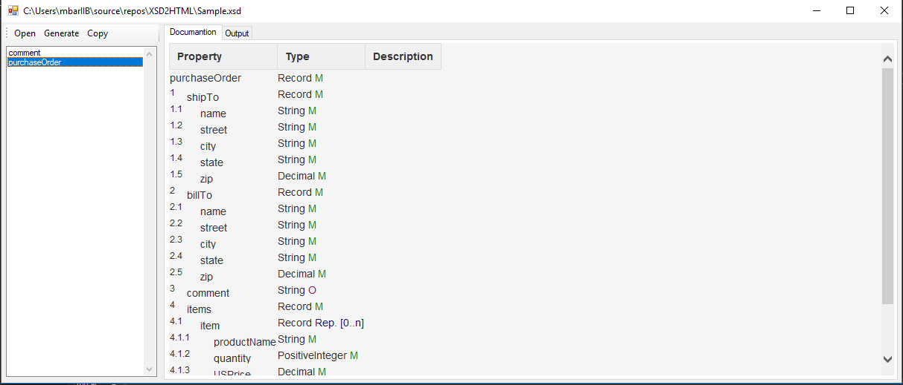

# XSD2HTML
this documantion tool that read the XSD file and genrate a HTMO page 
 
the output table is compatible with [confluence](https://www.atlassian.com/software/confluence)  
you can drage the xsd file 

# ToDo:
drill down into the restrictions 
provide hyperlink to the element parent 
extract the documentation 
If you think I can add more features please add it to the issues 
 
 
if you like my application below is my ETH wallet 

 0xa63a46064d74641F7bFa47dA9C4D11a49B253055
